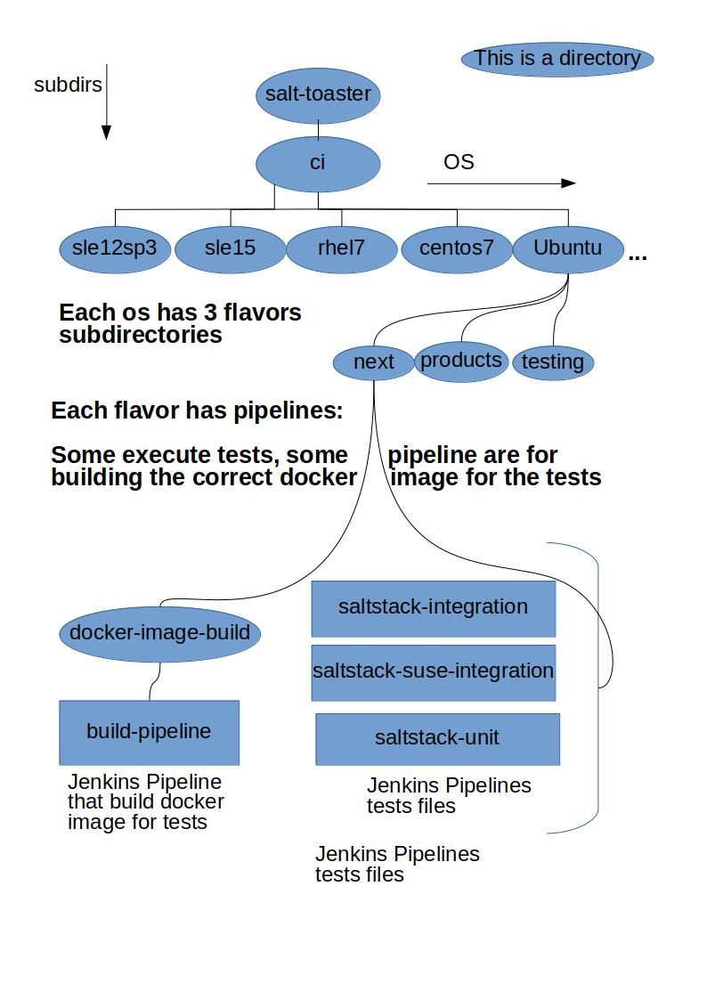

# Salt-toaster pipelines

Welcome to salt-toaster jenkins pipelines!

# How is the design architecture of toaster pipelines?

## Currently workflow

Currently you need to create the 1st time the pipeline jobs manually.
Then you can say to the jenkins job to pull the code from here.
This manual configuration is only needed by first iteration, once you create the pipeline that will take the code from this repo, everytime you push code here, the pipeline will use latest code from pipeline.

We might add in future the jenkins-builder plugin for creating the pipeline automatically.
